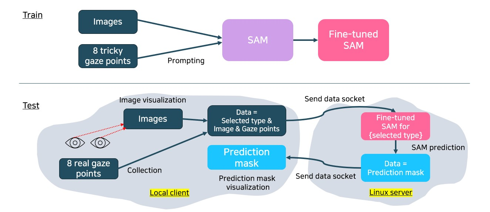
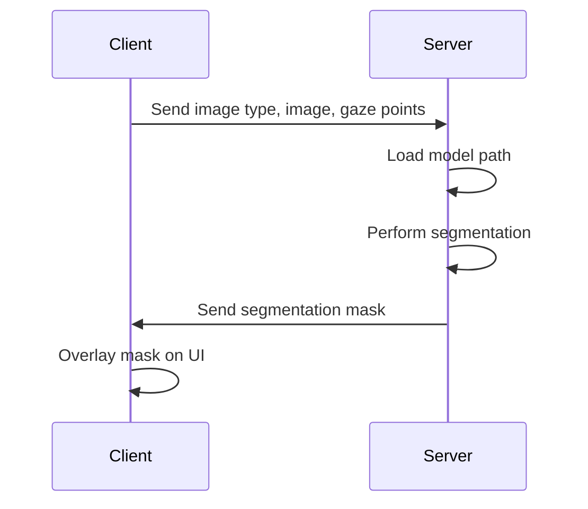
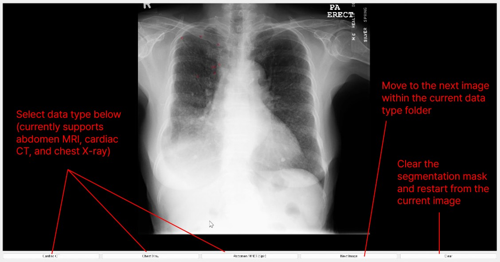
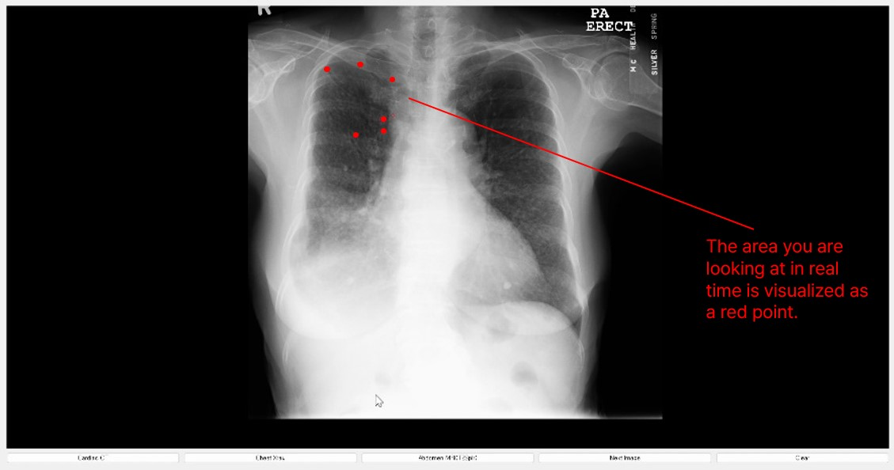
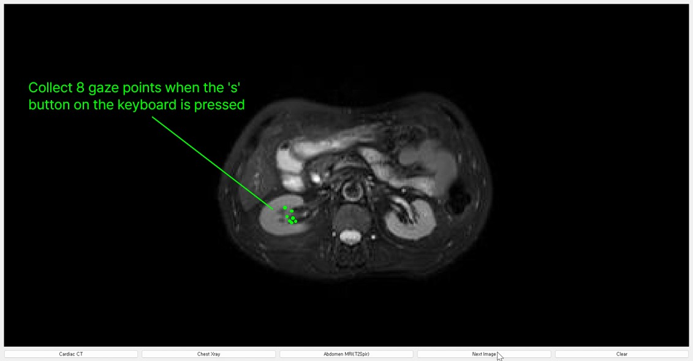
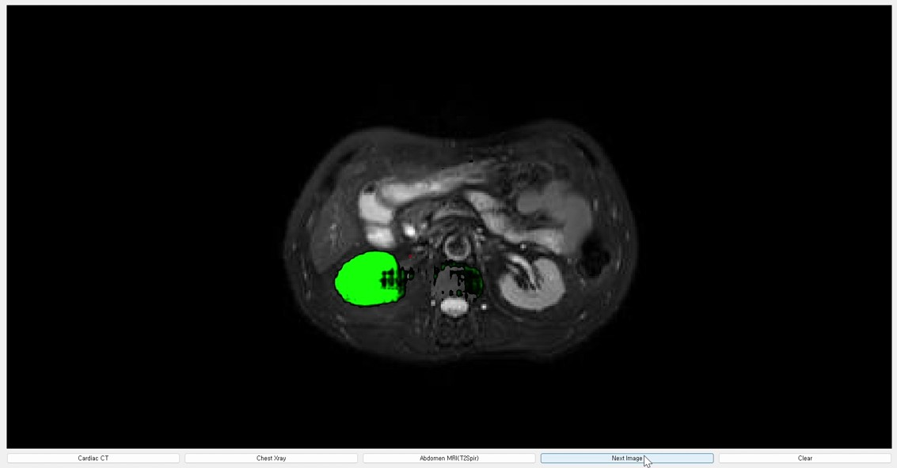

# SALYS: Segment Any Lesion You See in real time
 

 
*This research is Mijin Yoo's graduation research from the Department of Electrical and Electronic Engineering at Yonsei University, and was supervised by MAILAB (Medical Artificial Intelligence Laboratory) at Yonsei University.
(Advisor: Prof. Dosik Hwang)*
 
 

## Abstract
The SAM model performs zeroshot segmentation by providing points or bounding boxes as a prompt, and this study was conducted to segment lesions in medical images using this model in real-time eye tracking points. 
For each dataset(CT, MRI, etc.), 8 random points on the GT mask for each image were made into tricky gaze points and fine-tuned, and inference was performed using each fine tuning model path.
The entire system assumed that the hardware connecting the eye tracker and the GPU server predicting the segmentation mask were not the same.
Therefore, it was designed so that sockets can be exchanged on both sides, assuming that UI visualization and gaze collecting are performed on the client, and model prediction is performed on the Linux server.
Based on this study, if real-time eye tracking segmentation for medical images is activated, a system that allows specialists to easily visualize lesions through eye tracking during diagnosis and confirm it to patients is expected.
 
 

## Codes

#### System Architecture

The system is divided into two main components: the client and the server. The client handles the user interface (UI) and eye tracking, while the server handles model inference and segmentation mask generation.

#### Data Flow

 

## UI & Results

